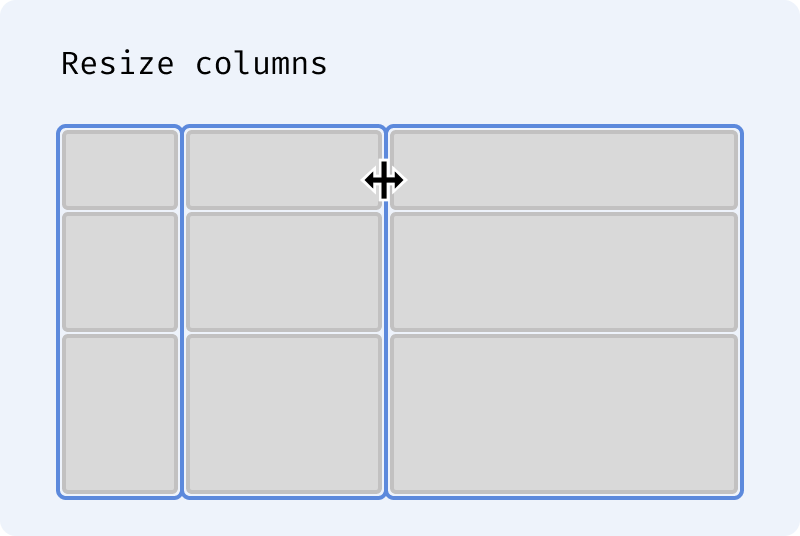
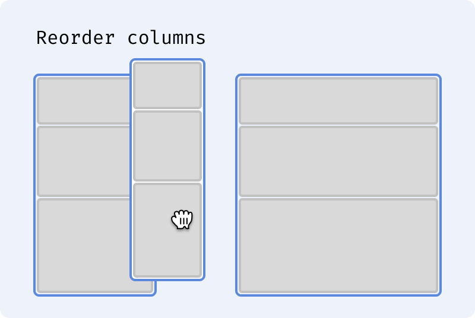
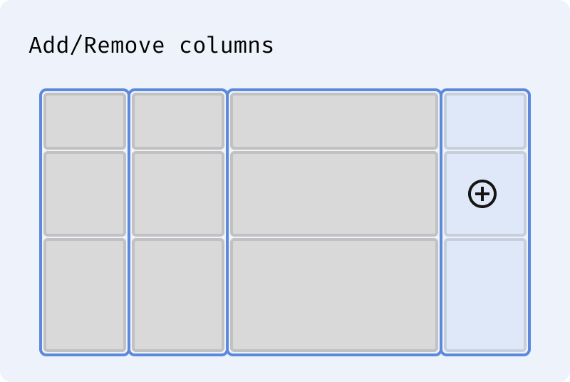
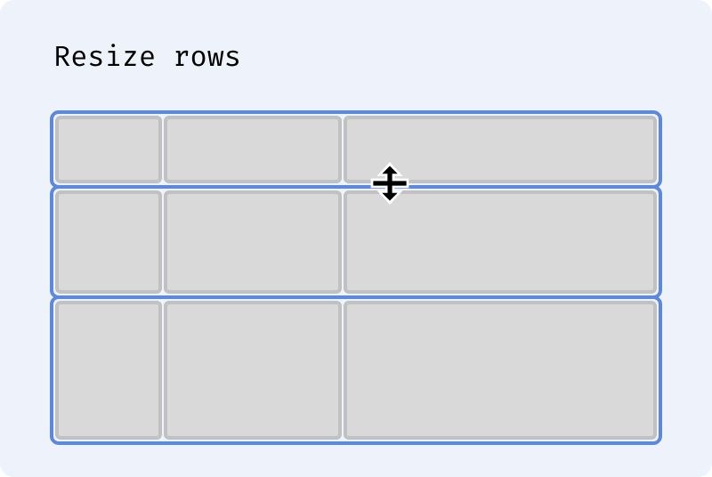
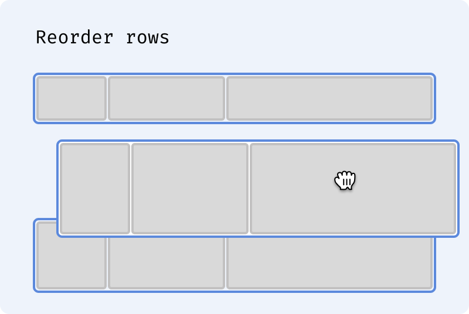
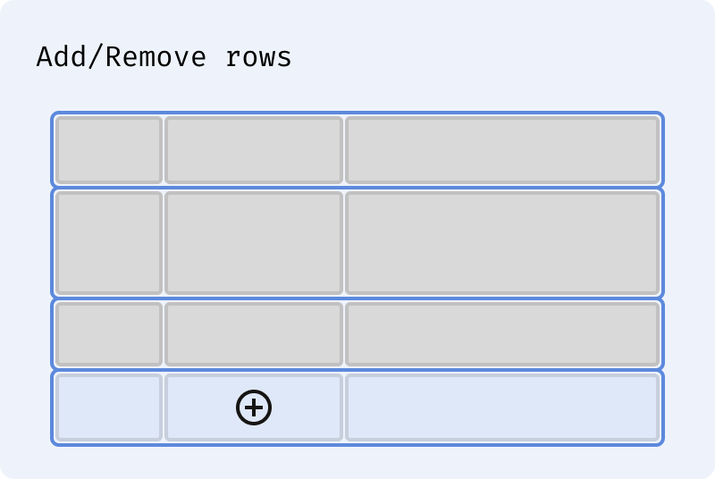

# Table Layout Switcher

A Figma plugin that detects whether a selection is a **column-first** or **row-first** table and switches it to the other layout while preserving cell sizing, fill behavior, and auto layout properties.

### As Columns...

  

### As Rows...

  

## Layout types

- **Column-first:** The table root is a `HORIZONTAL` auto layout frame. Its direct children are **column** containers (vertical stacks), each holding the cells for that column.
- **Row-first:** The table root is a `VERTICAL` auto layout frame. Its direct children are **row** containers (horizontal stacks), each holding the cells for that row.

The plugin infers layout from auto layout axes: `HORIZONTAL` root + `VERTICAL` inner ⇒ column-first; `VERTICAL` root + `HORIZONTAL` inner ⇒ row-first.

## Requirements

- The table root must be a **single** frame or component.
- Its direct children must be container frames (or components/instances) that each have the **same number** of children (the cells).
- Cells can be frames or component instances.

## Usage

1. **Install:** In the plugin folder run `npm install` then `npm run build` to generate `code.js`.
2. **Load in Figma:** Plugins → Development → Import plugin from manifest… and choose the folder containing `manifest.json`.
3. **Run:** Select the table root frame, then run **Table Layout Switcher**.
4. The UI shows the current layout (column-first or row-first) and a **Switch to other layout** button.

## Behavior when switching

### Sizing

- **Column widths** are taken from the widest cell in each column.
- **Row heights** are taken from the tallest cell in each row.
- Cell widths and heights are applied from the corresponding column/row measurements.

### Fill behavior

Fill (`layoutGrow=1`) is preserved across switches:

- A **fill-width column** (col-first) → cells with `layoutGrow=1` in each row (row-first).
- A **fill-height row** (row-first) → cells with `layoutGrow=1` in each column (col-first).
- When any cell fills a container's primary axis, that container's `primaryAxisSizingMode` is set to `FIXED` (not HUG) so fill children have a concrete dimension to divide up.

### Row-first layout

| Element       | Width                                | Height              |
| ------------- | ------------------------------------ | ------------------- |
| Row container | FILL (stretches to root table width) | FIXED, HUG, or FILL |
| Cell          | FIXED or FILL                        | FILL (row)          |

### Column-first layout

| Element          | Width         | Height                          |
| ---------------- | ------------- | ------------------------------- |
| Column container | FIXED or FILL | FILL — stretches to root height |
| Cell             | FILL (column) | FIXED or FILL                   |

### Visibility

Hidden state is re-evaluated per container after each switch, with a single element controlling visibility at each level:

- **Hidden container → hidden cells:** If a source row or column container is hidden, that hidden state is pushed down to each of its cells before restructuring.
- **All-hidden cells → hidden container:** After cells are placed into new containers, if every cell in a container is hidden, the container itself is set to hidden and its cells are restored to visible. This keeps one element (the container) in control rather than hiding every cell redundantly.
- **Partial visibility** (some cells hidden, some visible within a container) passes through unchanged — individual cell hidden states are preserved.

### Root container

When the layout axis flips, `primaryAxisSizingMode` and `counterAxisSizingMode` are swapped so each physical dimension (width/height) retains its original HUG/FIXED behavior. Spacing (`itemSpacing`) and padding are preserved unchanged.

## Development

```bash
npm install
npm run build
```

After changing `code.ts`, run `npm run build` again before testing in Figma.
